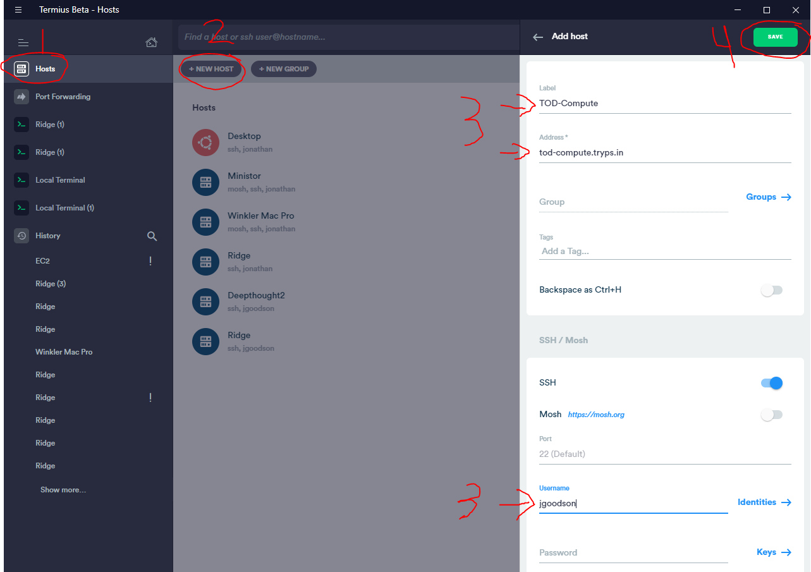
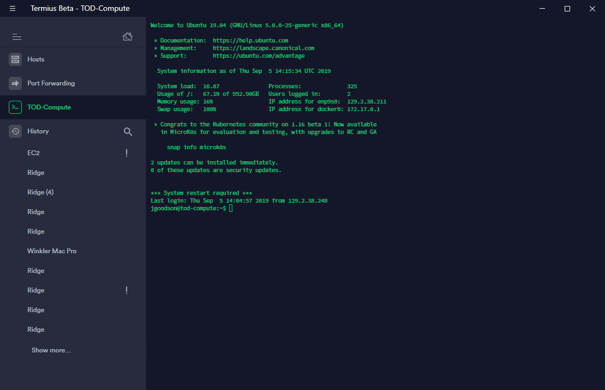
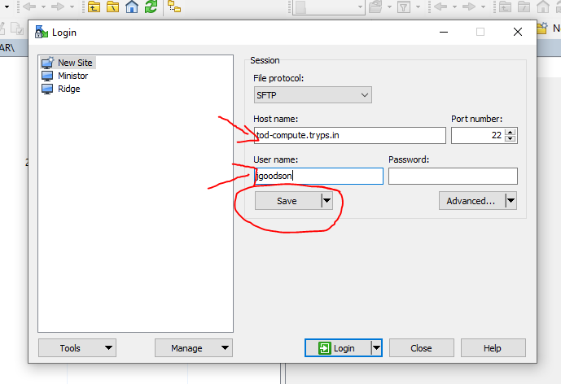
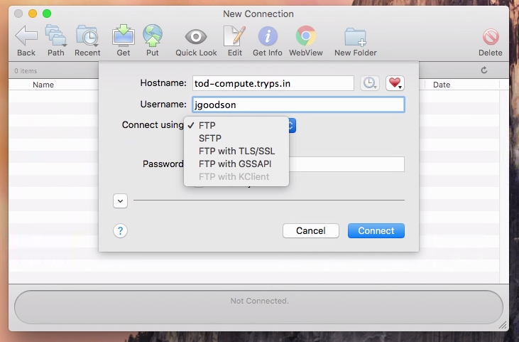
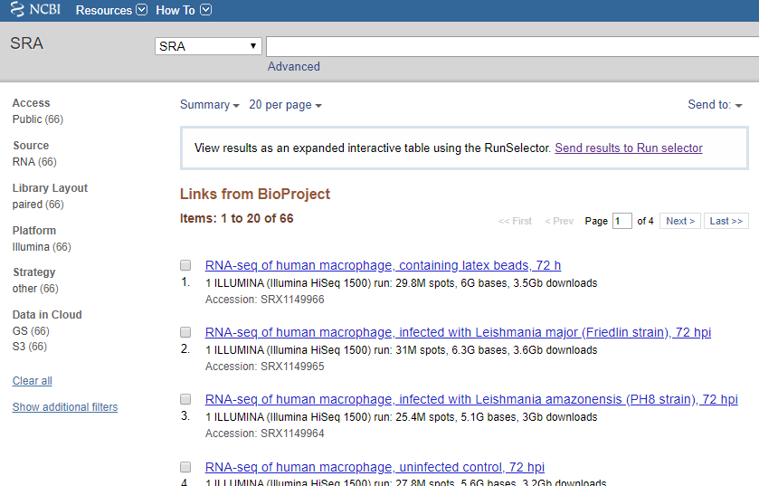

*Note: This assignment has a number of associated questions you'll find as you go through this that need to be submitted on ELMS. Some of these ask you to explain or guess why certain things may be the way that they are. I am not grading on correctness here, rather I am grading based on whether you have completed the assignment and put some thought into the answers. Feel free to discuss these with your group or with me in lab. We will likely go over some of the more important material during class as well.

# 1-i. Connecting to our computing resources.

## Connecting to the command line

Since the datasets we will be using are quite large (entire experiments can take up almost a terabyte of space uncompressed) substantial parts of the analysis cannot easily be done on personal computers. We have a computer set up in the lab with the software we will need pre-installed with plenty of storage space. 

For the majority of the work, we will be connected to the command line interface remotely. We will be using a method called SSH or Secure SHell to do so. If you already have opinions or preferences about what software to use for this, feel free to use whichever method you like. 

For simplicity, I recommend downloading a free program called Termius https://termius.com/ to connect. 

To get started connecting to our server, after installing you should go to the "Hosts" menu and choose "+ NEW HOST". Once you do that you can fill in the Label, Address, and Username fields. Your username will be your university Directory ID. Unfortunately, we could not get integration with the university systems, so your password will not match. I've set your password to be your UID number. Since this is predictable, we'll have you change this immediately. This also happens to be the first grade point available for ASN2!



Finally, click the save button and the connection will be stored in the list of Hosts. Double click on the TOD-Compute option and Termius should prompt you for your password (currently your UID). Enter that and you should be connected! If it shows a prompt mentioning that the host key is new you can accept this, this should only happen the first time you connect and the program will remember these details later.



Once you are connected, the first thing you should do is change your password. This is as simple as running one command:

```bash

passwd

```

Running `passwd` will prompt you for your current password, then ask you to enter your new password twice. For security, this program doesn't show your password or even asterisks as you are typing it, so don't worry when nothing shows up.

Successfully connecting to `tod-compute` and changing your account password so that I cannot login with your old password gets 1/4 points for ASN2. If you would like you can go back and edit the TOD-Compute host entry in Termius to save your password so that you do not need to type it in every time you connect.

Some notes: This machine has a fast 1 TB solid-state drive and a slower network-connected 8 TB shared drive. Be default any files you download or create onto this machine will be on the SSD. Since we are going to be working with huge datasets at times if everyone tries to store everything on the main disk we will rapidly run out of space. 


When you log in you should already have one folder created in your home directory named `storage`. This is a link to a folder on the large shared drive which you can store large files in. More on this later on!

At some points, we will also want to be able to transfer files to and from our personal computers and the server. Unfortunately, I am not a fan of any of the free programs that will work on all computers. I will suggest you downloading and install WinSCP if your personal computer runs Windows (https://winscp.net/eng/download.php) or Fetch if it runs macOS (https://fetchsoftworks.com/fetch/download/). WinSCP is free to use, but Fetch requires a license. Fortunately, this is free for Academic purposes, so once you get Fetch installed you should apply for the free license (https://fetchsoftworks.com/fetch/free).

### Connecting with WinSCP

Connecting with either program is similar to connecting with Termius. When you open WinSCP it will automatically open the Login window and default the connection method to "SFTP" which we will be using.



You can save this connection in the same way. Once you have this all set up, you can hit "Login" at the bottom. This again may warn you about the host key, go ahead and accept that again in this program.

This will open up a two-panel window similar to Windows Explorer, with your computer/files on the left side and the remote server files on the right side. Transferring files is as simple and clicking and dragging where you would like them to go.

### Connecting with Fetch

Connecting with Fetch should be nearly identical, on the first run the program will open up the New Connection window where you can put the hostname and username. Fetch defaults to the "FTP" connection mode which is insecure and not enable on our server. Simply use the dropdown and select "SFTP" and connect. Unlike WinSCP Fetch has only a single side showing the remote server files. To transfer files to or from the server you can click and drag from a Finder window.



At this point, we should be set up with everything we need to use the computing resources (at least until we get to differential expression analysis and visualization in a few weeks!)

# 1-ii. Understanding our reference genome

To begin, we want to get more familiar with the genome and transcriptome we will be studying initially. In our case, this main genome is the human reference genome. We will be using the most recent version, version 38 from NCBI Ensembl (GRCh38). We will be interacting with the data in a few ways.

- Directly on the raw sequence data at the whole-genome, chromosome, or individual transcript levels
- Using annotated versions of the genomic data where genes, regulatory elements, or other features are listed by location
- With a web-based interacting database allowing us to search and explore a wide range of database resources from one location

To save some time and space during these steps, you'll be using only one chromosome at a time for this exercise, chromosome 22.

## Reference genome sequences

The web-based database for the genome assembly is available at the Ensembl website (https://useast.ensembl.org/Homo_sapiens/Info/Index). Another resource for viewing this information is available on the UCSC website and GRCh38/hg38 (https://genome.ucsc.edu/cgi-bin/hgGateway).

The most current human genome sequences are available on the EMBL-EBI FTP (ftp://ftp.ensembl.org/pub/release-86/fasta/homo_sapiens/dna/). These are compressed FASTA files containing raw assembled genome sequence. There are three variants of the files, one that is labeled "dna" and contains the full sequence. The other two are labeled "dna_rm" and "dna_sm". These are the same sequence, but with some repetitive or duplicated elements removed or "masked" out. We will be using the main "dna" files.

First, we should make a directory to do our work for this assignment. You can name this whatever you like or put it wherever you like.

```bash

cd ~
mkdir ASN2
cd ASN2

```

We can now download the sequence for chromosome 22 directly from the EMBL-EBI FTP.

```bash

wget ftp://ftp.ensembl.org/pub/release-86/fasta/homo_sapiens/dna/Homo_sapiens.GRCh38.dna.chromosome.22.fa.gz
ls -lh

```

Since this file is compressed, we won't be able to work with it directly. The `.gz` suffix indicates that it is a "gzip" compressed file. We can decompress this file with the command `gzip -d [filename]`. 

Q1) What does this do to the file and file name? (Check with `ls -lh` before and after)

Take a look inside the chr22 sequence file to look at the general format of the FASTA files:

```bash

head Homo_sapiens.GRCh38.dna.chromosome.22.fa

```

Then to look at a sort of summary view, use the `wc` command to count the number of lines, "words", and characters in the file:

```bash 

wc Homo_sapiens.GRCh38.dna.chromosome.22.fa

```

Q2) How many lines and characters are there in our sequence file? Use either the Ensembl or UCSC genome browsers to search for chr22 and find out how many DNA base pairs are present in chromosome 22. How well does this match up with what we find from the file and why might they be different?

The beginning of our sequence file may look a little funny. Use the line count you got from the `wc` command to take a look in the middle of the file. To easily pull out some lines in the middle, you can use a combination of the `head` and `tail` commands to get the front of the file up to a certain point, and then the end of that section. Aim for a number of lines roughly halfway through the file.

```bash

head -n 425000 | tail

```

Q3) Do the beginning and middle of the file look similar? Why might one part be different than another?

Q4) How many of each base (A, C, G, T, or N) are present in chromosome 22? There are multiple ways to answer this. Hint: using `grep` with the `-o` flag outputs every match on a new line instead of entire lines.

Advanced question worth an extra half hour of lab time: AQ1) Restriction sites are DNA elements targeted by special enzymes known as "restriction enzymes" which cut DNA. How many EcoRI sites are present in chromosome 22?

### The purpose of the reference genome files

The FASTA reference genome sequence is essential for determining where any particular DNA/RNA sequence in our sequencing data derived from. Read alignment software like TopHat, BWA, or HISAT2 will require these FASTA files to match the short DNA sequence fragments to. After we know what part of the genome a particular fragment comes from, we can infer which transcripts this fragment may have been a part of and in aggregate how many of each transcript there were in the original sample.

## Reference transcriptome

The reference genome is a great resource and has every bit of genome information we know about at this point, but it represents the entire physical existence of the DNA chromosomes. We care about how that information gets transcribed into RNA, and that process involves selecting only certain bits of DNA, transcribing them into RNA, and then cutting and pasting bits of that RNA back together to generate the final transcript. The information that we need to predict how this happens is present in some annotation we will look at next, but the transcript sequences themselves are also available for us. These can be found on the same Ensembl FTP as the genome sequences in a different folder (ftp://ftp.ensembl.org/pub/release-86/fasta/homo_sapiens/cdna/). 

These are labeled as cDNA, as opposed to RNA or transcripts. Since modern sequencing methods require DNA, to determine the sequence of RNA transcripts, a biology trick is necessary to "reverse transcribe" RNA into DNA. Since this generates a piece of DNA complementary to the RNA strand, this is known as "complementary DNA" or "cDNA". There are two types of sequence files available one labeled "abinitio" and one labeled "all". The *ab initio* sequences are a limited set of sequences predicted using simple models directly from the genome file. The *all* sequence files contain several times more transcripts, types of transcripts, and variant transcripts (isoforms) and represent all of the known transcripts compiled from experimental databases. 

Let's download each version:

```bash

wget ftp://ftp.ensembl.org/pub/release-86/fasta/homo_sapiens/cdna/Homo_sapiens.GRCh38.cdna.abinitio.fa.gz
wget ftp://ftp.ensembl.org/pub/release-86/fasta/homo_sapiens/cdna/Homo_sapiens.GRCh38.cdna.all.fa.gz
gzip -d Homo_sapiens.GRCh38.cdna.abinitio.fa.gz
gzip -d Homo_sapiens.GRCh38.cdna.all.fa.gz

```

Since the FASTA format begins each sequence with a special line and follows with any number of lines of sequence, multiple sequences may be included in a single file.

```

>Sequence1
CGGCATTATCGGAGCTAGCTAGCTGACTG
CGATGAGCATTACGGTA
>Sequence2
GCTAGCGATGCGGCGATTAGCGGGGAGAG
ATCGATGGGACGATGTATGCGTATG

```

The sequence name line always starts with the `>` character.

Q5) How many transcripts are in each version of the cDNA sequence files?

### The purpose of the reference transcript files

Not all methods for transcriptome analysis use direct read alignment to genomes. In recent years, tools such as Sailfish, Kallisto, or Salmon have become available to rapidly and directly estimate the original number of transcripts directly from the individual DNA fragment sequences. These approaches use lists of individual transcript sequences instead of the original genome sequence. Although these methods do not give you full alignments useful for things like variant calling or other techniques and cannot identify any new transcripts, they can be invaluable for efficiently quantifying the number of each transcript for expression analysis. Since this is the main focus of this FIRE stream, we will likely lean heavily on these transcript-focused approaches.

## Reference genome annotation

With only the raw DNA sequence, or even the raw cDNA sequences, there isn't a lot we can do. I certainly can't figure out much biologically meaningful information manually from one cDNA sequence, much less tens of thousands. Fortunately, since we began sequencing and studying the human genome, thousands of researchers have spent decades investigating every bit of the human genome. Since this is science, the community has published, collected, and organized this information in a variety of ways to let use associate bits of the human genome with relevant biological information. In general, this process is called *annotation*. 

There are several common file formats for containing gene-level annotation of genomes, but perhaps the most common is GTF/GFF. Both file types are very similar, with some subtle differences (https://www.ncbi.nlm.nih.gov/genbank/genomes_gff/). Both formats are simple text files containing one feature annotation per line. Lines that start with `#` are "comment" lines and don't represent features but do include information that might be useful for orienting yourself with the file. Each normal line contains nine columns separated by tabs. The first eight columns are simple names, numbers, or symbols representing the name, type, and location of the feature. The final column can be much more complicated and contains a list of attributes in name=value pairs. The details of the GFF3 format may be found at https://github.com/The-Sequence-Ontology/Specifications/blob/master/gff3.md

Since these features are referenced to specific numeric locations in a sequence file, any annotations much match up to a specific reference genome sequence. The Ensembl FTP has files available both for individual chromosomes as well as the entire chromosome or transcript cDNA files. 

```bash

wget ftp://ftp.ensembl.org/pub/release-86/gff3/homo_sapiens/Homo_sapiens.GRCh38.86.chromosome.22.gff3.gz
gzip -d Homo_sapiens.GRCh38.86.chromosome.22.gff3.gz
head -n 20 Homo_sapiens.GRCh38.86.chromosome.22.gff3

```

Q6) The third column of the gff3 files contain the type of feature. How many different types of features are present on chromosome 22? How many coding sequences (CDS) are there? How many standard "gene" annotations are there? What does this tell you about the relationship between "genes" and coding sequences? You may want to refer to other resources like in the introduction to this section.

###  The purpose of the reference sequence annotation

When running alignment-based approaches, the exon and transcript level annotations are essential for determining what RNA/cDNA sequences might exist. Individual strings of DNA letters may show up in our RNA sequencing data that do not exist together in the original genome. These might be due to events like splicing which fuse two distant sequences together, or from non-templated addition like in the poly-A tails at the end of mRNAs.  Aligners like TopHat or HISAT2 will use these annotations to properly map these types of reads.

Beyond the process of alignment, these annotation files contain the information that lets us know what gene or gene variant is associated with any particular transcript. Knowing what sequence is what gene is essential for interpreting the results, understanding what changes and what doesn't change and therefore what is happening in the biology of our samples. This is the case whether we choose to align directly to the genome or use transcriptome-level quantification tools.

# 1-iii. Obtaining transcriptome quantification data

So far we have taken a look specifically at the human reference information. None of this is specific to the experiments we want to analyze. Much like the reference, our data is present in some sequence databases. In contrast to the reference genome though, our data is in a more specialized database intended to provide a warehouse for large amounts of publicly-accessible high-throughput sequence data called the Short Read Archive (SRA). The SRA is hosted by the NCBI, part of the National Institute of Health in Bethesda, Maryland. It is part of an interconnected series of databases which include a variety of annotation about about experimental data. 

## Exploring the data in the NCBI databases

Some of the relevant NCBI databases for obtaining and understanding our data will be `BioProject`, `BioSample`, `SRA`, and `PubMed`. The first of these, `BioProject`, (https://www.ncbi.nlm.nih.gov/bioproject/) is designed to contain, categorize, and describe whole experimental projects. This database will contain links not only to the raw data hosted in databases like `SRA` or `GEO`, but also to any publications that may be associated with this data as well as metadata associated with the raw data itself. 

Some of this metadata is present in the `BioSample` database. This is intended to be a higher-level description of the raw data, each entry is, much like the name, a biological sample that some data derived from. This could be a particular batch of cells grown in a test tube, an environmental sample of water, a biopsy of human tissue, or essentially any other biological unit of physical *stuff* we might sample to generate data. The `BioSample` entries themselves may then be associated with raw data that was derived from that particular biological sample. The quality of this annotation may vary from experiment to experiment because it is up to the individual scientist submitting this to the database to decide which information to include in the submission to the database.

The `BioProject` entries themselves often contain only a brief summary of the experimental goals and data content. In many cases, to really understand what all of the samples represent and how they were generated, you may need to read the associated publications to get enough information. 

We will be working with data that largely resides in two `BioProject` entries. The accession number for the *Leishmania* datasets has the `BioProject` accession
 PRJNA290995. The data for the *Trypanosoma cruzi* is associated with `BioProject` PRJNA251582. Searching for these in the link provided above should bring up the summary page for each project. Clicking on the number of SRA experiments brings you to a result list in the SRA database. A link at the top of the page should bring you to the SRA Run Selector which lets you interact and download a table containing more information about the data itself.
 
 
 
 Q7) How many RNA-seq datasets are present in each of the two projects? For the *Leishmania major* experiment, how many of these correspond to samples containing parasite infections and how many to non-infected control samples? What other potentially import biological variables can you find in the annotation for these experiments?
 
 Q8) Who is the lead author of the journal article associated with the *Leishmania* project? What publication was this published it?
 

 
 